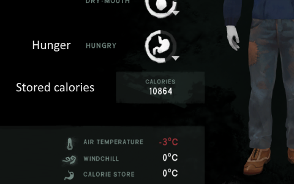
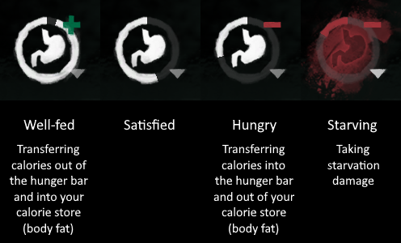

# HungerRevamped — mod for *The Long Dark*

> **Fork of the original [HungerRevamped](https://github.com/BaltaZar-7/HungerRevamped) by BaltaZar.**  
> v2.2.0 adds stability fixes, null safety, performance improvements, and full EN/RU localization.  
> See [CHANGELOG.md](CHANGELOG.md) for the full list of changes.

---

## Why this mod exists

*The Long Dark's* default hunger system has fundamental problems:

- It cannot differentiate between starving for a few days and starving for months
- Players can survive indefinitely on only 600 calories per day
- Calorie deficits never need to be compensated
- Long-term starvation barely affects the player

## How it works

Hunger Revamped **splits nourishment into two values: hunger and stored calories**.

> 

**Hunger** works like the standard bar — it drains over time and refills when you eat.  
When hunger drops below 20%, you start taking starvation damage (up to −5% condition per hour at the worst).

**Stored calories** represent body fat and change slowly.  
You can store up to **20 000 calories** — roughly a week's worth of energy.

- Staying **well-fed** (hunger bar above 60%, shown by a green **+**) slowly builds up your fat reserves.  
- Going **hungry** (hunger bar below 35%, shown by a red **−**) slowly drains reserves back into the hunger bar.

This means that large fat reserves protect you from starvation — but burning through them leaves you vulnerable.

> 

**Body fat also affects temperature:**  
- Full reserves: up to **+2 °C** warmth bonus  
- Depleted reserves: up to **−3 °C** warmth penalty

---

## Gameplay Effects

### No more hibernation

You can no longer exploit the hunger system by starving during the day and eating before sleep.  
The emptier your hunger bar, the more calories are pulled from your fat reserves instead.  
Over time your reserves deplete, starvation damage accelerates, and sleep can no longer compensate.

### Keeping yourself fed is a real challenge

Surviving on 600 calories per day made food gathering trivial even in Interloper.  
With HungerRevamped, you must actually maintain a proper calorie intake to stay healthy.

If you want an even greater food challenge, consider installing
[WildlifeBegone](https://github.com/zeobviouslyfakeacc/WildlifeBegone/releases) —
it makes wildlife much rarer, so you can't simply hunt your way to infinite food.

### Start of the game

You begin with **12 000 stored calories**, giving you a buffer before food becomes critical.  
In Custom Mode, the starting amount is configurable.

### Travelling

High fat reserves mean you can travel light — less food to carry, more room for gear.  
The warmth bonus also helps when spending extended time outdoors.

### Sleeping, fishing, harvesting, breaking down objects

All activity screens now show your **hunger bar percentage and stored calories after the interaction**,  
instead of raw calories burned. This makes planning much more meaningful.

When sleeping, keep your hunger bar above 20% to allow health regeneration.

### Cooking Skill Points

- Cooking **ruined food** gives no skill points.
- Cooking a **partial portion** of meat gives a proportional chance of a skill point.  
  (e.g., cooking 0.5 kg of meat → 50% chance of a point)

### Delayed Food Poisoning

Food poisoning has an incubation period of **4–16 hours** — you won't get sick instantly.  
If you take antibiotics before symptoms appear, there is a chance the poisoning is prevented.

### Gradual Food Poisoning Probability

The risk of food poisoning scales gradually with the food's condition (75%+ is safe; 15%− is high risk)  
and with how much you eat. Eating half a portion is roughly half as likely to cause poisoning.

### Ruined Food

- **Ruined food is inedible** by default (toggle in settings).
- **Cooking ruined food** does not restore its condition (toggle in settings).
- **Canned food** can be harvested for a recycled can even when ruined.

---

## Settings

All settings are accessible via **ModSettings** in the main menu or pause menu.

| Section | Setting | Default |
|---|---|---|
| Ruined Food | Can eat ruined food | Off |
| Ruined Food | Can cook ruined food | Off |
| Food Poisoning | Delayed food poisoning | On |
| Food Poisoning | Gradual poisoning probability | On |
| Food Poisoning | Remove Cooking Lv.5 immunity | Off |
| Cooking | Fix cooking skill exploit | On |
| Cooking | Cooking doubles condition | On |

Settings are available in **English** and **Russian**. You can add more languages by placing a `localization.json` file in `UserData/HungerRevamped/`.

---

## Installation

1. Install [MelonLoader](https://github.com/HerpDerpinstine/MelonLoader/releases/latest/download/MelonLoader.Installer.exe)
2. Install [ModSettings](https://github.com/zeobviouslyfakeacc/ModSettings) **v2.2.5 or newer**
3. Install [ModData](https://github.com/dommrogers/ModData)
4. Download `HungerRevamped.dll` from the [releases page](https://github.com/NicoriciN89/HungerRevamped/releases)
5. Place `HungerRevamped.dll` in your TLD `Mods/` folder

**Existing saves are supported.** Installing on an old save starts you with 10 000 stored calories.  
Uninstalling is safe — your save continues normally, but stored calorie data is lost.

---

## Recommendations

- Avoid Pilgrim mode — a better hunger system matters little at 50 calories per hour.
- Install [EnableStatusBarPercentages](https://github.com/zeobviouslyfakeacc/EnableStatusBarPercentages/releases) to see exact hunger bar percentages.

---

## Building from source

Requires .NET 6 SDK and a copy of *The Long Dark* with MelonLoader installed.

1. Clone the repository
2. Open `HungerRevamped.csproj` and set `<TheLongDarkPath>` to your TLD install directory
3. Run `dotnet build -c Release`

The compiled DLL is automatically copied to your `Mods/` folder after a successful build.

---

## License

MIT — see [LICENSE](LICENSE).  
Original mod by [BaltaZar](https://github.com/BaltaZar-7/HungerRevamped).
